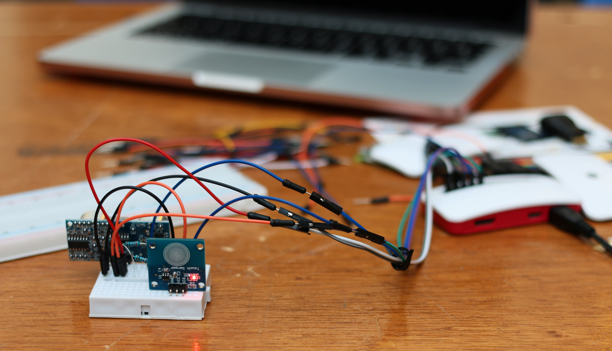

# MyPiNotify

## An IoT notifications platform.

Landing Page: http://www.MyPiNotify.me

Application: http://app.MyPiNotify.me

## Description
MyPiNotify is a painless notification system for RasberryPi IOT devices. Installation consists of entering your wifi credentials into our app, then MyPiNotify does the hard work, it creates a custom Rasberry Pi Image for you with networking enabled. Flash this onto your PI and you are good to go.

## Sensors
Currently the system runs two sensors, but the possibilities are endless. Sensors are hot swappable so there is no need to flash a new rom when adding or removing a sensor.

### Capacitive Touch Sensor
- Notifies you when its being pressed.

### Ultrasonic Distance Sensor
- Notifies you when something comes within 10 cm of it
- Can accurately detect objects up to 1m from the sensor

### Screenshots of the Application

Home Page:

Team Page:

Contact Page:

### Images of the hardware hack

Pi Project:

Motion Sensor:

Touch Sensor:

### Team
* Andrei
* Brynn
* Dominique
* Jake
* Jordan

### Created for NWHacks 2017
